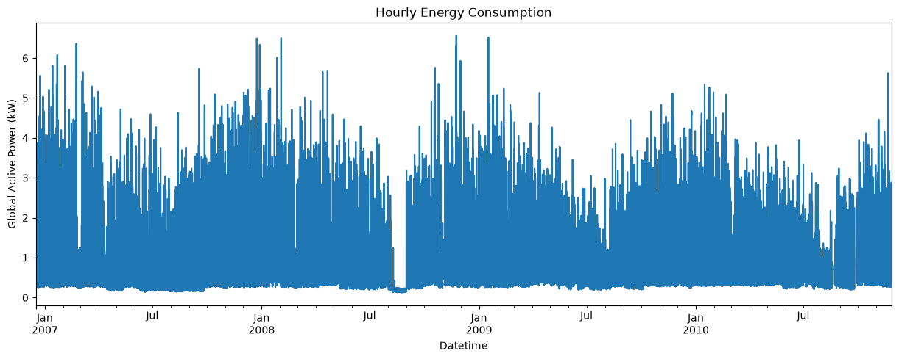
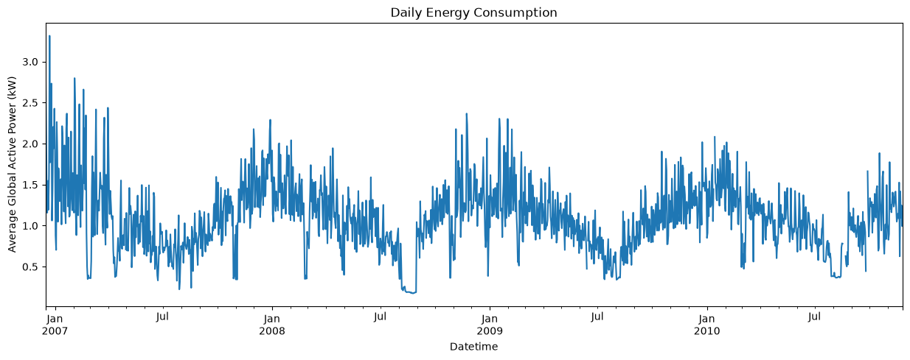
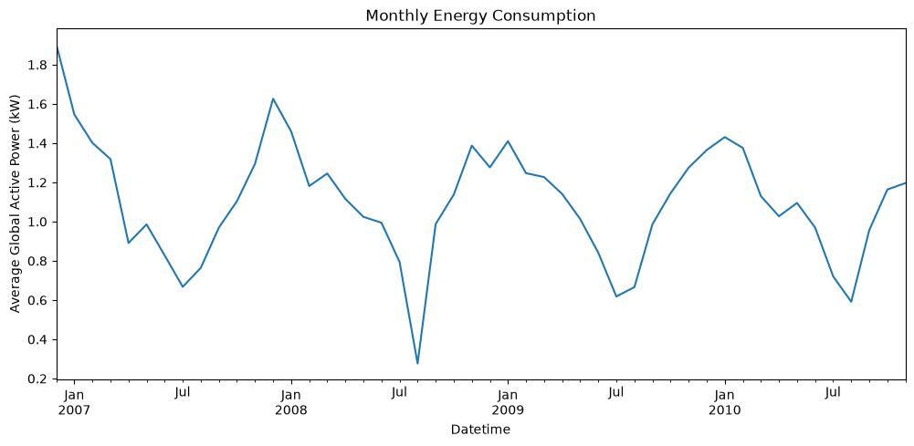
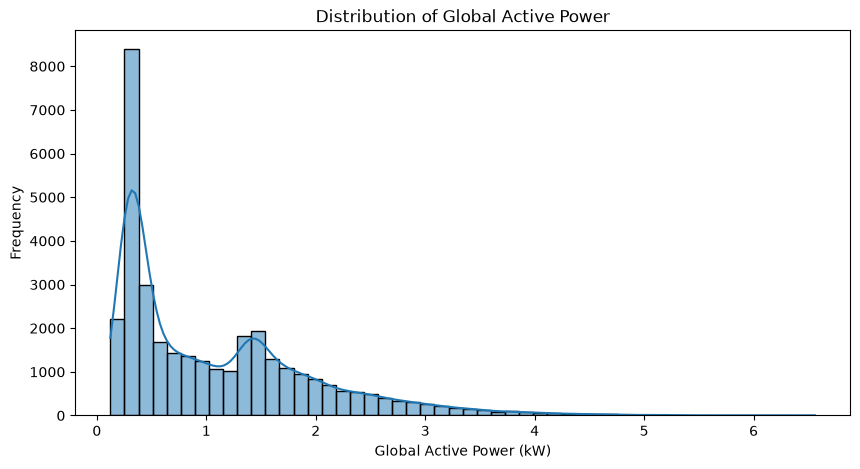
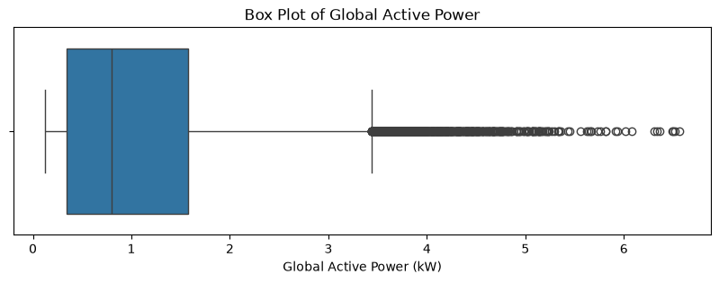

# Household Energy Consumption Forecasting

This project forecasts short-term household electricity consumption using historical power usage data, comparing a classical statistical model, a decomposition-based model, and a machine learning model. These forecasts help utility operators and smart-home systems anticipate demand and optimize energy usage.

A full write-up of the methodology, findings, and business recommendations is available in **`Household_Energy_Forecasting_Report.docx`**.

## Project Structure

- **`data/`**: Contains raw (`household_power_consumption.txt`), cleaned (`household_power_consumption_cleaned.txt`), exported model predictions (`model_predictions.csv`), and XGBoost feature importances (`xgboost_feature_importances.csv`).
- **`notebooks/`**:
  - [001_data_overview.ipynb](notebooks/001_data_overview.ipynb): Initial data loading, profiling, and inspection of the raw dataset.
  - [002_data_cleaning.ipynb](notebooks/002_data_cleaning.ipynb): Datetime parsing, missing-value handling, and resampling to hourly averages.
  - [003_eda.ipynb](notebooks/003_eda.ipynb): Exploratory Data Analysis, visualizing trends, seasonality, and distributions.
  - [004_models.ipynb](notebooks/004_models.ipynb): Feature engineering (temporal, lag, rolling) and training of ARIMA, Prophet, and XGBoost.
  - [005_evaluation_comparison.ipynb](notebooks/005_evaluation_comparison.ipynb): Model evaluation, comparison, and business insights.
- **`images/`**: Contains all generated visualization plots, saved automatically after rendering.
- **`Household_Energy_Forecasting_Report.docx`**: Compiled report covering the full pipeline, model comparison, and business recommendations.

---

## Dataset

The raw dataset contains **2,075,259 minute-level records** spanning December 2006 to November 2010, with nine attributes: `Date`, `Time`, `Global_active_power`, `Global_reactive_power`, `Voltage`, `Global_intensity`, and three sub-metering channels. After removing rows with missing values (25,979 rows, affecting all power-related columns identically) and confirming zero duplicate rows, the data is resampled to hourly averages, producing a cleaned hourly dataset used for downstream analysis and modeling.

## Methodology

1. **Data Cleaning** — datetime construction, missing-value audit and removal, and resampling from minute-level to hourly averages.
2. **Exploratory Data Analysis** — hourly/daily/monthly trend visualization, value distribution, and outlier detection.
3. **Feature Engineering** — temporal features (`Hour`, `Day`, `Month`, `Weekday`, `Weekend`), lag features (`Lag1`, `Lag24`, `Lag168`), and a rolling 24-hour mean (`Rolling24`).
4. **Train/Test Split** — sequential split reserving the last 500 hours for testing, preserving temporal order (32,887 train / 500 test).
5. **Modeling** — `ARIMA(5,1,2)` on the raw series, `Prophet` on `ds`/`y`-formatted data, and `XGBRegressor` on the full engineered feature set.
6. **Evaluation** — forecasts scored with MAE and RMSE, visualized against actuals, and compared via XGBoost feature importances.

---

## What's New

1. **Detailed Explanations**: A structured markdown cell is added before **every single code cell** in each notebook, explaining **what** the cell does and **why** it is done.
2. **Plot Auto-Saving**: Every plot generation cell in the notebooks now ends with a `plt.savefig(...)` command to automatically export the visual outputs to the `images/` directory.
3. **Compiled Report**: All findings, model comparisons, and business recommendations are now consolidated into `Household_Energy_Forecasting_Report.docx` for easy sharing.

---

## Generated Visualizations

Here are the plots generated during the analysis and saved in the `images/` folder:

### 1. Hourly Energy Consumption
Shows the full hourly Global Active Power series across the entire observation period.

### 2. Daily Consumption Trend
Smooths intraday fluctuations to reveal day-to-day and weekly cyclical patterns.

### 3. Monthly Consumption Trend
Aggregates to monthly averages, exposing seasonal peaks in winter and dips in summer.

### 4. Distribution of Global Active Power
Histogram with KDE overlay showing the right-skewed spread of hourly power readings.

### 5. Box Plot of Global Active Power
Highlights the median, interquartile range, and outlier consumption hours.

### 6. Model Forecast Comparison vs Actual
Overlays ARIMA, Prophet, and XGBoost forecasts against actual test-period consumption.

### 7. XGBoost Feature Importance
Ranks engineered features by their relative contribution to XGBoost's forecasts.

---

## Model Results

Three models were trained and evaluated on the final 500 held-out hours:

| Model | MAE | RMSE | Notes |
|:---:|:---:|:---:|:---|
| ARIMA(5,1,2) | 0.676 | 0.824 | Statistical baseline; no external features |
| Prophet | 0.549 | 0.701 | Automatic trend/seasonality decomposition |
| **XGBoost** | **0.361** | **0.529** | Best performer; relies on engineered lag & temporal features |

**Key insight**: The most predictive feature for XGBoost is the immediately prior hour's consumption (`Lag1`), followed by the same hour on the previous day (`Lag24`) — confirming that household energy usage is strongly autoregressive with both short-term and daily-cycle dependencies. Full model trade-offs and scenario-based recommendations are detailed in the report.

---

## Tech Stack

`pandas` · `numpy` · `matplotlib` · `seaborn` · `scikit-learn` (metrics) · `statsmodels` (`ARIMA`) · `prophet` · `xgboost` (`XGBRegressor`)